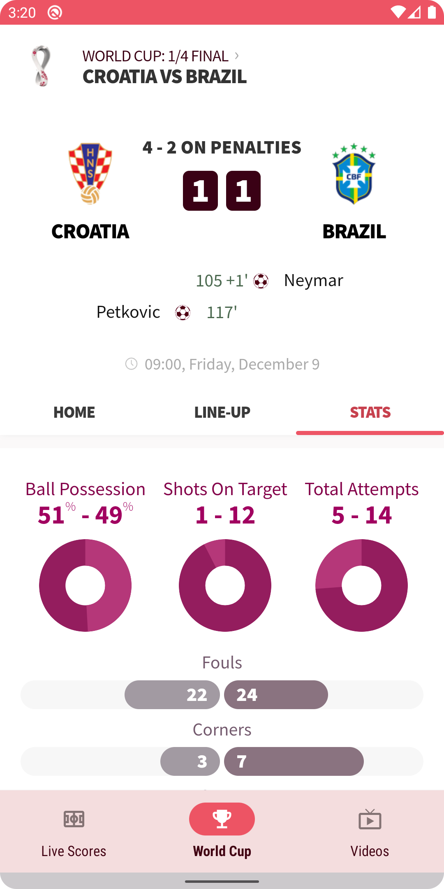
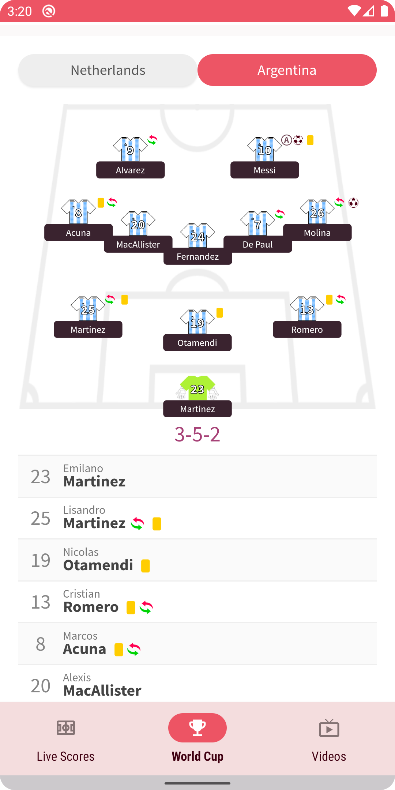
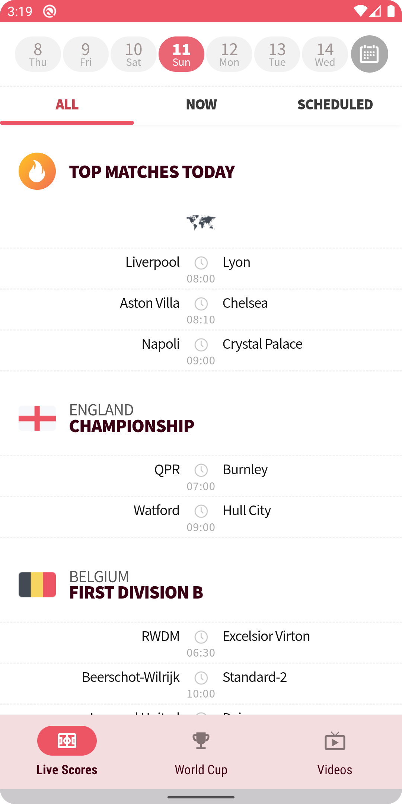
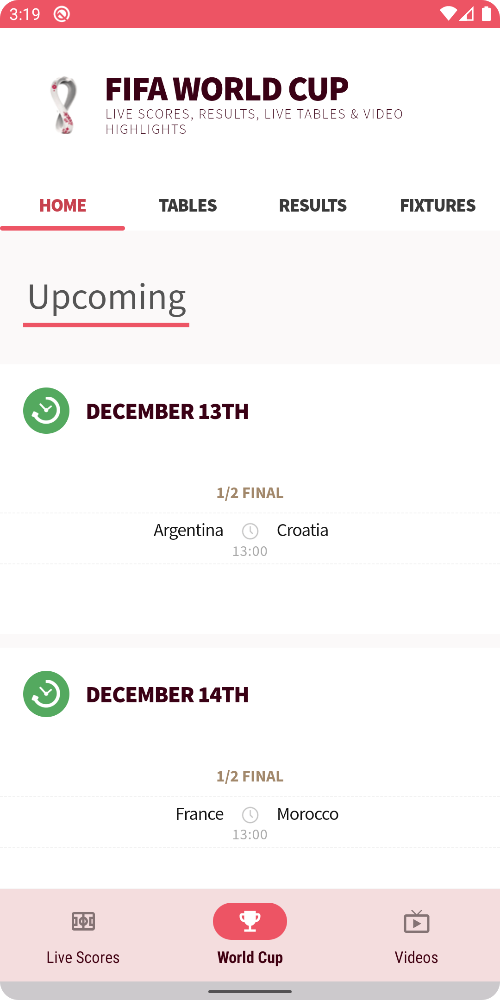
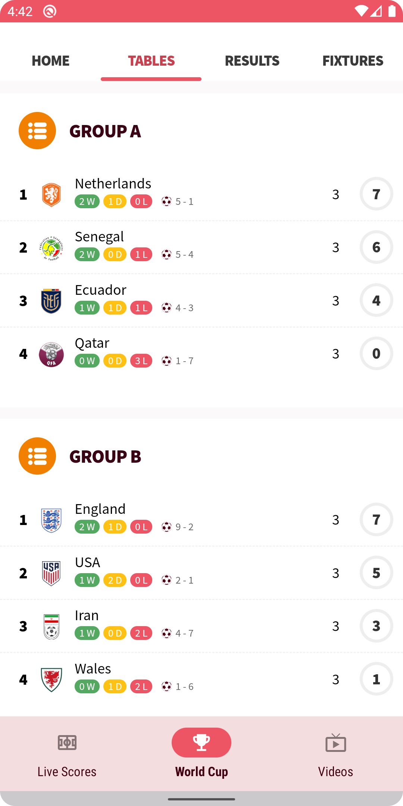
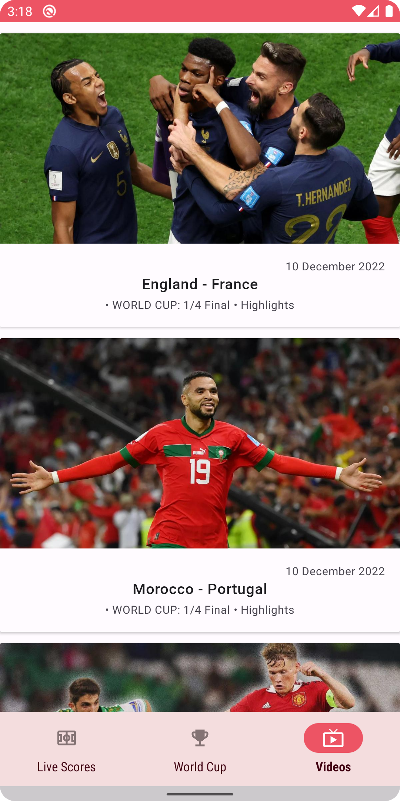

<br />
<div align="center">
  <a href="https://github.com/othneildrew/Best-README-Template">
    
  </a>

<h1 align = "center">
<b><i>Goalie</i></b>
</h1>

  <p align="center">
    A Football App that provides World Cup Info!
    <br />
    <a href="#-screenshots-">Screenshots</a>
    ·
     <a href="#-requirements-">Requirements</a>
    ·
    <a href="#-structure-">Structure</a>
    ·
     <a href="#-technologies-">Technologies</a>
    ·
    <a href="#-license-">License</a>
  </p>
</div>


Goalie is a Football App which provides an easy and quick access to the most recent world cup matches: with their respective matches, live scores, lineups, stats and recent videos.

This project is used in order to show how to use webviews in Android, as the widgets provided are embedded via iFrames.

## 📷 Screenshots 📷 

This Project uses [**Material 3**](https://m3.material.io/), the latest version of Google's open source design system known as *Material Design*.

| Match Stats  | Lineup | Live Scores | 
| ------------- | ------------- |  ------------- |
|   |   |   | 


| Upcoming Fixtures | Table Standings | Recent Highlights | 
| ------------- | ------------- |  ------------- |
|   |   | 

## 📝 Requirements 📝 

This project uses the ScoreBat API to provide the aforementioned widgets and videos.
In order to run this project, it is necessary to specify the API keys in the `local.properties` file, in the following way:
```groovy
SCORE_BAT_TOKEN = "MY_SCORE_BAT_WIDGET_TOKEN"
VIDEO_API_TOKEN = "MY_SCORE_BAT_VIDEO_API_TOKEN"
```
These fields are later on read as `BuildConfig` fields in the code and created in the `build.gradle.kts` file from the App Module, as in:
```kotlin
// Read SCORE_BAT_TOKEN key from local.properties
val scoreBatToken: String = gradleLocalProperties(rootDir).getProperty("SCORE_BAT_TOKEN")
buildConfigField("String", "SCORE_BAT_TOKEN", scoreBatToken)
// Read VIDEO_API_TOKEN key from local.properties
val videoApiToken: String = gradleLocalProperties(rootDir).getProperty("VIDEO_API_TOKEN")
buildConfigField("String", "VIDEO_API_TOKEN", videoApiToken)
```

For more information, you can [create an account](https://www.scorebat.com/account/) in the Website.

## 📁 Structure 📁 

The structure of this project is simple, and tries to follow the Google-recommended MVVM (when required), as exemplified by the following diagram:


## 🚀 Technologies 🚀 

This project uses many popular libraries and tools in the Android ecosystem:

* **Dagger Hilt**: A fully static, compile-time dependency injection framework for both Java and Android.
* **OkHttp**: Square’s meticulous HTTP client for the JVM, Android, and GraalVM.
* **Retrofit**: A type-safe HTTP client.
* **Kotlin Coroutines**: Managing background threads with simplified code and reducing needs for callbacks.
* **Kotlin Flow**: Cold asynchronous data stream that sequentially emits values
* **Jetpack Navigation**: Implement navigation and transactions between fragments.
* **Moshi**: Converts data used by an application to a format that can be transferred over a network or stored in a database or a file.
* **DiffUtil:**  Improving RecyclerView's performance when handling list updates.
* **Lifecycle**: Perform actions in response to a change in the lifecycle status of another component.
* **ViewModel**: Designed to manage and store UI related data in a lifecycle conscious way.
* **Coil**:An image loading library for Android backed by Kotlin Coroutines.
* **ViewBinding**: Allows you to more easily write code that interacts with views.
* **Material 3**: The latest version of Material Design, introduced in Android 12.
* **Shimmer**: Provides an easy way to add a shimmer effect to any view in your Android app.
* **Splash Screen API**: Provides a launch animation for all apps when running on a device with Android 12 or higher. 
* **Material Motion**: A set of transition patterns that can help users understand and navigate an app.


## 🪶 Author(s) 🪶 

**Jon Areas**, [*@jxareas*](https://github.com/jxareas).

## 📜 License 📜 

```
Copyright (c) 2022 Jonathan Areas

Permission is hereby granted, free of charge, to any person obtaining a copy
of this software and associated documentation files (the "Software"), to deal
in the Software without restriction, including without limitation the rights
to use, copy, modify, merge, publish, distribute, sublicense, and/or sell
copies of the Software, and to permit persons to whom the Software is
furnished to do so, subject to the following conditions:

The above copyright notice and this permission notice shall be included in
all copies or substantial portions of the Software.

Notwithstanding the foregoing, you may not use, copy, modify, merge, publish,
distribute, sublicense, create a derivative work, and/or sell copies of the
Software in any work that is designed, intended, or marketed for pedagogical or
instructional purposes related to programming, coding, application development,
or information technology.  Permission for such use, copying, modification,
merger, publication, distribution, sublicensing, creation of derivative works,
or sale is expressly withheld.

This project and source code may use libraries or frameworks that are
released under various Open-Source licenses. Use of those libraries and
frameworks are governed by their own individual licenses.

THE SOFTWARE IS PROVIDED "AS IS", WITHOUT WARRANTY OF ANY KIND, EXPRESS OR
IMPLIED, INCLUDING BUT NOT LIMITED TO THE WARRANTIES OF MERCHANTABILITY,
FITNESS FOR A PARTICULAR PURPOSE AND NONINFRINGEMENT. IN NO EVENT SHALL THE
AUTHORS OR COPYRIGHT HOLDERS BE LIABLE FOR ANY CLAIM, DAMAGES OR OTHER
LIABILITY, WHETHER IN AN ACTION OF CONTRACT, TORT OR OTHERWISE, ARISING FROM,
OUT OF OR IN CONNECTION WITH THE SOFTWARE OR THE USE OR OTHER DEALINGS IN
THE SOFTWARE.
```
